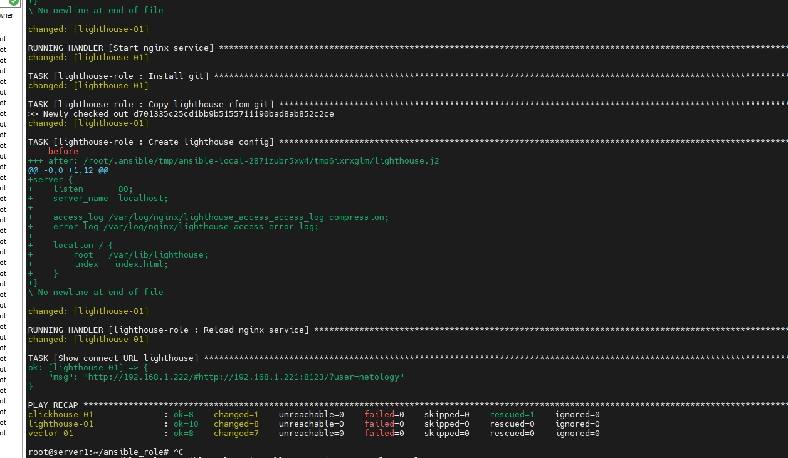

# Домашнее задание к занятию "8.4 Работа с Roles" dev-17_ansible-04-role-yakovlev_vs
ansible-04-role


## Подготовка к выполнению
1. Создайте два пустых публичных репозитория в любом своём проекте: vector-role и lighthouse-role.
2. Добавьте публичную часть своего ключа к своему профилю в github.

## Основная часть

Наша основная цель - разбить наш playbook на отдельные roles. Задача: сделать roles для clickhouse, vector и lighthouse и написать playbook для использования этих ролей. Ожидаемый результат: существуют три ваших репозитория: два с roles и один с playbook.

1. Создать в старой версии playbook файл `requirements.yml` и заполнить его следующим содержимым:

   ```yaml
   ---
     - src: git@github.com:AlexeySetevoi/ansible-clickhouse.git
       scm: git
       version: "1.11.0"
       name: clickhouse 
   ```

2. При помощи `ansible-galaxy` скачать себе эту роль.
3. Создать новый каталог с ролью при помощи `ansible-galaxy role init vector-role`.
4. На основе tasks из старого playbook заполните новую role. Разнесите переменные между `vars` и `default`. 
5. Перенести нужные шаблоны конфигов в `templates`.
6. Описать в `README.md` обе роли и их параметры.
7. Повторите шаги 3-6 для lighthouse. Помните, что одна роль должна настраивать один продукт.
8. Выложите все roles в репозитории. Проставьте тэги, используя семантическую нумерацию Добавьте roles в `requirements.yml` в playbook.
9. Переработайте playbook на использование roles. Не забудьте про зависимости lighthouse и возможности совмещения `roles` с `tasks`.
10. Выложите playbook в репозиторий.
11. В ответ приведите ссылки на оба репозитория с roles и одну ссылку на репозиторий с playbook.


### Решение 

1. Создан
 

2. Роль успешно скачалась. 
```bash
root@server1:~/ansible_role# ansible-galaxy install -r requirements.yml -p roles
Starting galaxy role install process
- extracting clickhouse to /root/ansible_role/roles/clickhouse
- clickhouse (1.11.0) was installed successfully
```
3. Созданы новые каталоги
```bash
root@server1:~/ansible_role/roles# ansible-galaxy role init clickhouse-role --force
- Role clickhouse-role was created successfully
root@server1:~/ansible_role/roles# ansible-galaxy role init lighthouse-role --force
- Role lighthouse-role was created successfully
root@server1:~/ansible_role/roles# ansible-galaxy role init vector-role --force
- Role vector-role was created successfully
```

- Шаги 4 - 7 выполнены

8. Ссылки на роли
  - [vector-role](https://github.com/Valdem88/vector-role.git)
  - [lighthouse-role](https://github.com/Valdem88//lighthouse-role.git)
  - [clickhouse-role](https://github.com/Valdem88/clickhouse-role.git)

9. Переработал
```bash
---
# Установка
- name: Install clickhouse
  hosts: clickhouse
  roles:
    - role: clickhouse-role

- name: Install vector
  hosts: vector
  roles:
    - role: vector-role

- name: Install lighthouse
  hosts: lighthouse

  handlers:
    - name: Start nginx service
      become: true
      ansible.builtin.service:
        name: nginx
        state: restarted
  pre_tasks:
    - name: Install epel-release | Install Nginx
      become: true
      yum:
        name: epel-release
        state: present
    - name: Install Nginx | Install Nginx
      become: true
      yum:
        name: nginx
        state: present
      notify: Start nginx service
    - name: Create Nginx config | Install Nginx
      become: true
      template:
        src: nginx.j2
        dest: /etc/nginx/nginx.conf
        mode: 0644
      notify: Start nginx service

  roles:
    - role: lighthouse-role

  post_tasks:
    - name: Show connect URL lighthouse
      debug:
        msg: "http://{{ ansible_host }}/#http://{{ hostvars['clickhouse-01'].ansible_host }}:8123/?user={{ clickhouse_user }}"
```

10. Добавил файл [requirements.yml](https://github.com/Valdem88/dev-17_ansible-04-role-yakovlev_vs/blob/main/requirements.yml)


11. Установил роли
```bash
    root@server1:~/ansible_role# ansible-galaxy install -r requirements.yml -p roles --force
Starting galaxy role install process
- changing role clickhouse-role from v1 to v1
- extracting clickhouse-role to /root/ansible_role/roles/clickhouse-role
- clickhouse-role (v1) was installed successfully
- extracting vector-role to /root/ansible_role/roles/vector-role
- vector-role (v1) was installed successfully
- extracting lighthouse-role to /root/ansible_role/roles/lighthouse-role
- lighthouse-role (v1) was installed successfully
```


12. Запуск playbook и успешное выполнение.
```bash
root@server1:~/ansible_role# ansible-playbook -i inventory/test.yml site.yml --diff
```



---

  - [playbook](https://github.com/Valdem88/dev-17_ansible-04-role-yakovlev_vs/blob/main/site.yml)
  - [vector-role](https://github.com/Valdem88/vector-role.git)
  - [lighthouse-role](https://github.com/Valdem88//lighthouse-role.git)
  - [clickhouse-role](https://github.com/Valdem88/clickhouse-role.git)

---

### Как оформить ДЗ?

Выполненное домашнее задание пришлите ссылкой на .md-файл в вашем репозитории.
